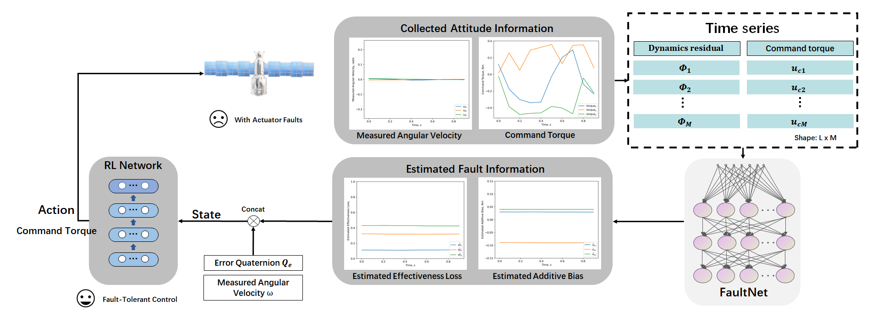

# fault-tolerant-control
### :bulb: Neural Network-Based Fault identification and Reinforcement Learning for Spacecraft Fault-Tolerant Control
<p align="center">

</p>

### keyword
Fault detection and identification, Fault-tolerant control, Neural Network, Reinforcement learning.

> Abstract: Active fault-tolerant systems are crucial for ensuring the reliability and safety of spacecraft attitude control, especially when dealing with actuator faults that could jeopardize mission success. 
This paper introduces a comprehensive framework for fault detection and identification (FDI) and fault-tolerant control (FTC) tailored to meet stringent real-time processing requirements and limited onboard resources. 
We propose a neural network-based fault identification approach, termed FaultNet, which utilizes LSTM architectures to achieve millisecond-level fault estimation. 
This method overcomes the long convergence times associated with traditional observer-based FDI techniques, enabling accurate identification of both constant and time-varying faults, including effectiveness loss and additive bias. 
For fault-tolerant attitude control in spacecraft, we develop a reinforcement learning (RL)-based controller, incorporating carefully designed state representations and reward functions to ensure robust performance. 
The proposed methods are rigorously evaluated across four customized fault scenarios, encompassing both constant and time-varying fault types. 
The results demonstrate the framework's effectiveness in swiftly stabilizing spacecraft attitude and precisely compensating for actuator faults. 
Simulation outcomes validate the neural network-based FDI's efficiency and accuracy, as well as the RL-based FTC's reliability, showcasing minimal fault estimation errors and consistent fault recovery performance.


## Getting started
### ⚙️:	Nerual Network based Fault Detection and Identification (FDI)


#### <a id="Step1">Step 1</a>: Download trainset and testset from [Google Drive](https://drive.google.com/drive/folders/1vIQYWuSMYidRRki7cP_ym5xDANR2gI-i?usp=sharing).
(This step is **unnecessary** since you can directly run dataset_generate.py.)

#### <a id="Step2">Step 2</a>: Train or Test FaultNet.
```.bash
# train FaultNet
cd fault_detection
python run.py --is_train=1

# test FaultNet
cd fault_detection
python run.py --is_train=0
```

#### <a id="Step3">Step 3</a>: Need to reproduce experimental results?
The [pretrained FaultNet model](./fault_detection/checkpoints/FaultNet/best_model.pth) can be found here.

### :robot: Reinforcement learning based Fault-Tolerant Control (FTC)


#### <a id="Step1">Step 1</a>: Modify the parameters in metadata.py.

#### <a id="Step2">Step 2</a>: Train the Hybrid Reward-SAC.
```.bash
python run_SAC.py
```

#### <a id="Step3">Step 3</a>: Need to reproduce experimental results?
 (use the [pretrained SAC model](./SAC_FTC_240202.zip))
```.bash
Set the seed to 240202.
Set the mode to ‘test’.
Set the scenario_id to 1/2/3/4.
python run_SAC.py
```
